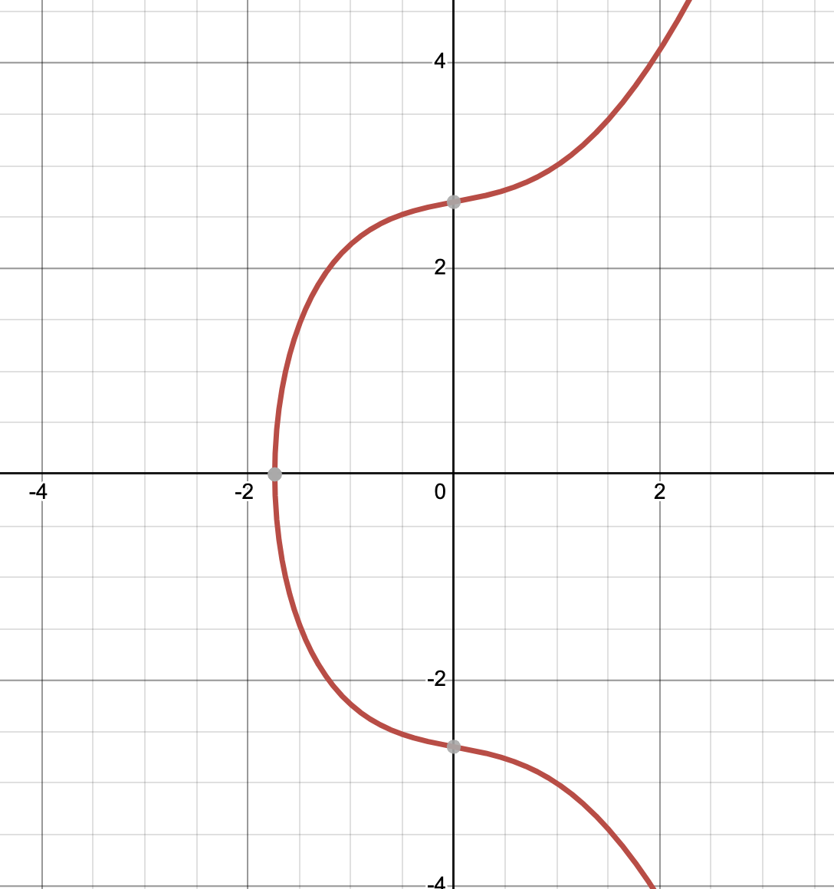

# Understanding Bitcoin Signature 3 -Elliptic Curve

# Elliptic Curve

The combination of elliptic curve and prime field arithmetic is utilized in various cryptographic applications due to the inherent difficulty of solving the discrete log problem.

### Elliptic Curve on Real Numbers

Elliptic curves have general form $y^2 = a x^3 + bx +c$. This is an example where a = 1, b = 1, c = 7 $y^2 = x^3 + x + 7$

Bitcoin uses the ‘secp256k1’ curve whose equation is $y^2 = x^3 + 7$

 In elliptic curve cryptography, a point on an elliptic curve can be represented as (x,y) and must fulfill the equation of the curve. The points on this curve also meet the four axioms of a field, including identity, associativity, inverse, and distributivity, since they are represented by real numbers, which form a field.

### Point Addition

The process of adding points on an elliptic curve is known as "point addition". This operation is defined by a specific set of rules and formulas that take into account the properties of the curve and the points being added. Depending on the specific scenario, the process can involve finding the intersection of a line with the curve. The number of points that a line intersects with the curve can also affect the point addition process, with there being the possibility of 1, 2, or 3 points.

1) The line intersects at  one point

2) The line intersects at 3 points

3) Special case: the line is a tangent line (intersects at 2 points)

4) Special case: the line intersects at 2 points as the line is vertical. 

In point addition on an elliptic curve, given a line that intersects with the curve at two points, the third point can be found by reflecting the third point over the x-axis. This is a result of the intersection of the line and the curve. There are three scenarios where a line can intersect with the elliptic curve, depending on how many times they meet, which can be 1, 2, or 3 points.

### Addition when $A \neq B$

Draw a line connecting point A and B. Then we get C. Reflect the point over X axis. This is the definition of A + B and the result is point D. What about A+C or B+C? Unlike A+B which resulted in the addition point on the right side, A+C will result in the point in the middle and B+C on the left side. It is not easy to predict where the added value will end up being. That’s why you saw the randomness in the final result with repeated addition. 

Let’s say $A = (x_1, y_1), B = (x_2, y_2), C = (x_3, y_3)$    

Slope $s = \frac{x_2 - x_1}{y_2 - y_1}$

$x_3 = s^2 - x_1 - x_2$

$y_3 = s(x_1 - x_3) - y_1$

This can be derived by comoputing $y^2 = (s(x-x_1)+y_1)^2 = x^3 + ax + b$ and $(x-x_1)(x-x_2)(x-x_3) = 0$

### Addition when $A = B$

This is case 3) where two points are same (in the tangent line) and we want to find the intersection where the tangent line crosses the curve. 

We want to find the slope s, $y^2 = x^3 + ax + b$ by taking derivative on both side. 

$2ydy = (3x^2 + a)dx$ which makes the $s = \frac{dy}{dx} = \frac{3x^2+a}{2y}$ 

Using the derived $x_3, y_3$ in the above example, 

$x_3 = s^2 - 2x_1$

$y_3 = s(x_1 - x_3) - y_1$

### Addition with Infinity

Addition operation satisfies field properties. In other words, the addition operation satisfies Identity, Commutativity, Associativity, and Invertibility. 

Ivertibility means there’s zero that will make $I + A = A$. $I$  is referred as the point at infinity. The two points in the picture is opposite to one another over X-axis. 

$P_1(x_1, y_1) + (Inf/Inf) = P_1(x_1, y_1)$

$P_1(x_1, y_1) + P_2(x_1, -y_1) = (Inf/Inf)$

### Commutativity and Associativity

Commutativity is met because the connecting line of two points doesn’t change depending on the points’ order. Also, the order of addition doesn’t change the result. 

## Elliptic Curve on Prime Fields

We can use the same equation on prime fields instead of the real numbers. If you mark points on the elliptic curve over the numbers in the finite fields, the end result shows great randomness as shown in the picture below. We use this randomness in cryptography. Note that as the prime fields use modulo operation, the points on the picture are not necessarily overlap over the actual elliptic curve over real numbers. 

[source: sagemath](https://doc.sagemath.org/html/en/thematic_tutorials/explicit_methods_in_number_theory/elliptic_curves.html)

The points on elliptic curve $\mathbb F_p$ fulfill $y^2 = x^3 + ax + b\:(\:mod\: p)$

Let’s take an example of $\mathbb F_{29}$  and secp256k1 ($y^2 = x^3 + 7$)

$P_1 (3, 18): 18^2 = 3^3 + 7\ (mod\ 29) = 5$

$P_2 (23, 20): 20^2 = 23^3 + 7\ (mod\ 29) = 23$

Continuing this to find more points in the elliptic curve will show randomness as shown in the example above. 

For the line that connects the two points, the slope $s = \frac{20 - 18}{23 - 3}$

Notice that you need to take modular multiplicative inverse of x2-x1, mod p. We want to know x that makes $20 ^ x\ mod\ 29 = 1$ for which $x = 27$. Hence, the slope is $s = \frac{20 - 18}{23 - 3} = 2 \cdot 20^{27}\:mod\:29 = 3$

$x_3 = 3^2 -23 - 3 = 12$

$y_3 = 3 \cdot (3 - 12) -18 \:mod\:29 = 13$

### Generating Group from Finite Field over Elliptic Curve

Each point $P_1(x_1,y_1)$ has its inverse $P_2(x_1, -y_1)$. $P_1(x_1, y_1) + P_2(x_1,-y_1) = (Inf/Inf)$

There is a generator point G whose multiplication eventually becomes the inverse of the G. The multiplication points of G consists a group $\{ G, 2G, 3G, ... ,nG\}$ where $nG \cdot G = (Inf, Inf)$

As seen from the result above, calculating multiplication and finding the next point is trivial, but point division is much more difficult. This is again the discrete logarithm problem. For example, finding $P^7 = Q$  using addition is trivial. However, the reversed question which is finding 7 when $P, Q$  are given is not calculable. To put it differently, for the given $P = G + G + G + ... + G + G = k \cdot G$, solve what $k$ is. 

Sources:

[https://github.com/jimmysong/programmingbitcoin/blob/master/ch02.asciidoc](https://github.com/jimmysong/programmingbitcoin/blob/master/ch02.asciidoc)

[https://teachbitcoin.io/presentations/ec_math.html#/21](https://teachbitcoin.io/presentations/ec_math.html#/21)

